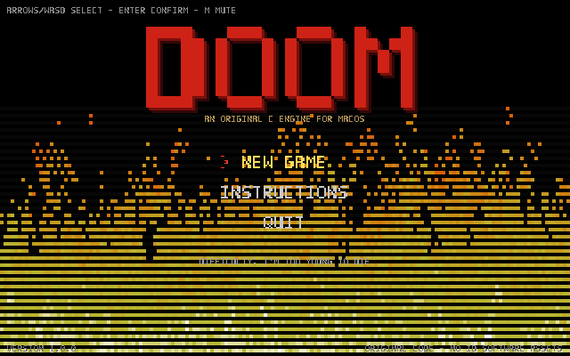
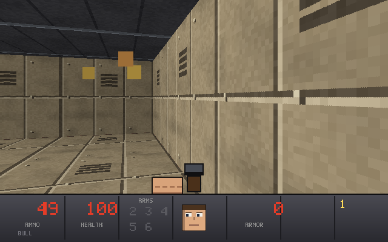
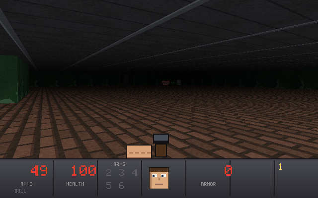

# DOOM-Mac

An original Doom-style FPS written in **pure C** for macOS. Software-rendered, zero external assets — every texture, sprite, sound effect and music track is generated procedurally by the code at startup.



> This is an original engine and game. It contains no id Software code or assets and is not affiliated with or endorsed by id Software or Bethesda.

## The experiment

This entire project was written by an AI coding agent in one session, from an empty directory, with a single prompt: *"write full doom original game in C in this directory, use computer controls until 100% done, iterate as much as needed."*

| | |
|---|---|
| Model | **ox-alpha** (max reasoning) |
| Harness | "pi" coding agent |
| Human input | 16 messages — 6 substantive, 9 were just "continue" |
| Output | 10 files, **5,850 lines** of C, first working build ~2 h in |
| Verification | headless test suite (~200 assertions) + deterministic screenshot tour the agent visually inspected |
| Notable bugs it caught | sprite-ID collisions, unlit walls, a 1-row texture upload (black screen), exit door openable with the wrong key |

## Run it

**Binary (Apple Silicon, macOS 12+):** download `DOOM-macOS.zip` or `DOOM.dmg` from [Releases](../../releases), unzip, then **right-click → Open** the first time (ad-hoc signature; Gatekeeper).

**From source:**

```bash
brew install sdl2
make            # build bin/doom
make dist       # build dist/DOOM.app + zip + dmg
./bin/doom      # play
```

## Controls

| Input | Action |
|---|---|
| `W A S D` / arrows | move (arrows turn) |
| Mouse | turn |
| Left click / `Ctrl` | fire |
| `Space` / `E` — or just walk into it | open doors |
| `1`–`5` / wheel | switch weapon |
| `Tab` | automap |
| `Esc` / `M` / `F11` | pause / mute / fullscreen |

Five maps: find keys, flip switches, push secret walls, survive the barons. Cheat codes for the desperate: `iddqd`, `idkfa`, `idclip`.



## Known bugs

- Maps are functional and fully connected, but layouts/encounters are simply authored — don't expect id-level level design
- Doors can show rendering gaps at sharp viewing angles (thin-wall raycaster edge case)
- Monster AI is chase-and-shoot with line-of-sight wake-up — no pathfinding, no infighting
- Apple Silicon only; no x86_64 build (Homebrew SDL2 is arm64)
- Ad-hoc code signature → first launch needs right-click → Open
- No save games, no mouse-sensitivity setting



## How it was verified

`make test` runs headless: flood-fill connectivity of every map, door flanking and lock logic, a scripted collision-free live simulation, combat/drop/explosion checks, pickup rules, and render checks for every game mode. `make shots` produces a deterministic screenshot tour of all five levels. The agent iterated against both until green — roughly 28 compile→fix cycles, with the test suite catching a sprite-table crash and the exit-door logic bug before a human ever ran it.

## License

MIT. See [LICENSE](LICENSE).
